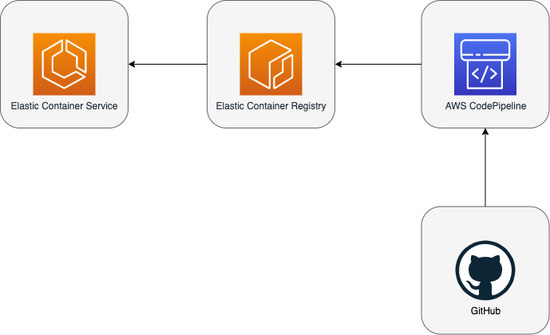

## AWS 101 - Containers

Goal of this task is to create architecture as show on below diagram.

1. Create simple **Hello World** REST API which returns message “Hello from REST API” in technology of your choice
2. Create **Dockerfile** for created API which expose it for consumption
3. Create **ECR** instance in AWS using **t2.micro** instance
4. Push image to **ECR**
5. Create **ECS** and consume published image from ECR
6. Open created service in Web browser
7. Create **Terraform** which deploy our infrastructure
8. Glue everything using **AWS CodePipeline** to deploy infrastructure and our image from **GitHub**

### Links

- Terraform - [https://registry.terraform.io/providers/hashicorp/aws/latest](https://registry.terraform.io/providers/hashicorp/aws/latest)
- AWS ECS - [https://aws.amazon.com/ecs/getting-started/](https://aws.amazon.com/ecs/getting-started/)
- AWS ECR - [https://aws.amazon.com/ecr/getting-started/](https://aws.amazon.com/ecr/getting-started/)
- AWS CodePipeline - [https://aws.amazon.com/codepipeline/getting-started](https://aws.amazon.com/codepipeline/getting-started)